# Manual Completo de Uso do Sistema FROTAS

> **Documento:** Manual operacional para usuários e administradores do Frota PMTF.
> **Sistema:** Frota PMTF - Prefeitura Municipal de Teixeira de Freitas.
> **Versão do manual:** versão atual do repositório.

## 1. Objetivo do manual

Este manual orienta o uso completo do sistema FROTAS, desde o primeiro acesso até as rotinas de cadastro, operação, relatórios, auditoria e gestão administrativa.

O conteúdo é voltado para usuários finais, operadores de produção, administradores e usuários de posto credenciado. Ele evita detalhes de desenvolvimento e concentra a explicação nos fluxos operacionais.

## 2. Perfis de acesso

| Perfil | Acesso principal | Indicação de uso |
|---|---|---|
| ADMIN | Todos os módulos, usuários, auditoria, analytics e gestão | Administração completa do sistema |
| PRODUCAO | Operação de frota, cadastros, veículos, posses, manutenção, sinistros, multas e abastecimentos | Equipe operacional da frota |
| POSTO | Ordens abertas de abastecimento vinculadas ao posto | Operador de posto credenciado |
| PADRAO | Acesso básico conforme liberação institucional | Consulta e uso restrito |

> **Segurança:** Senhas não devem ser compartilhadas, impressas em documentos públicos ou enviadas por canais não autorizados.

## 3. Acesso ao sistema

O acesso começa pela tela de login institucional. Informe o login autorizado e a senha definida pelo administrador. Ao entrar, o sistema carrega os módulos permitidos para o perfil do usuário.

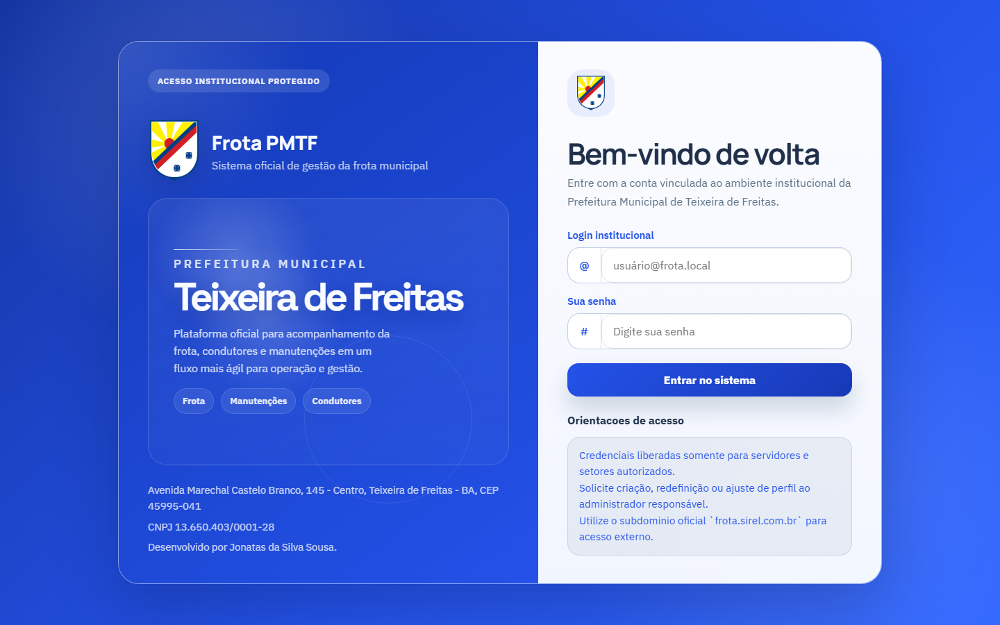

Quando o administrador cria um usuário novo ou redefine uma senha, essa senha é provisória. No primeiro acesso, o sistema abre um modal obrigatório para troca de senha. Enquanto a troca não for concluída, os demais módulos ficam bloqueados.

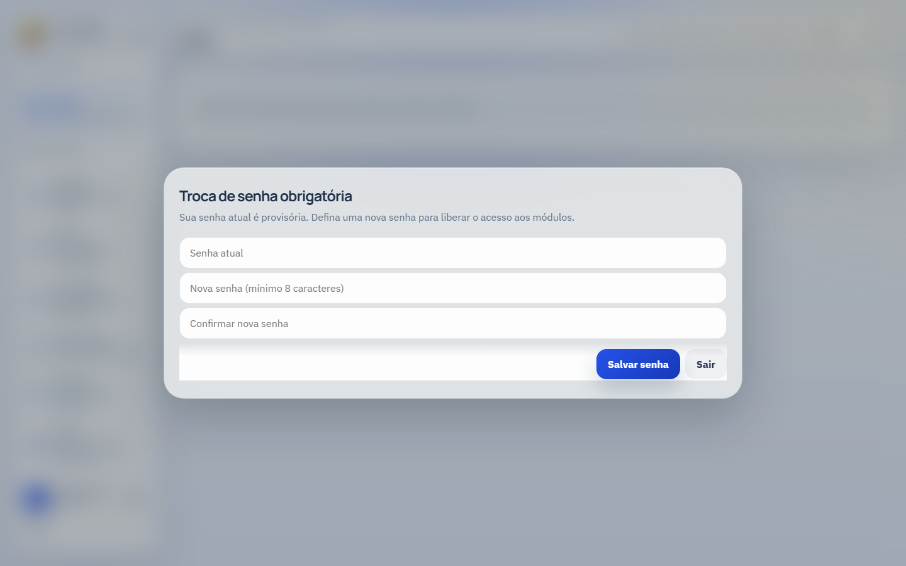

O usuário também pode alterar sua senha a qualquer momento pelo botão de conta no rodapé do menu lateral. O modal solicita a senha atual, a nova senha e a confirmação.

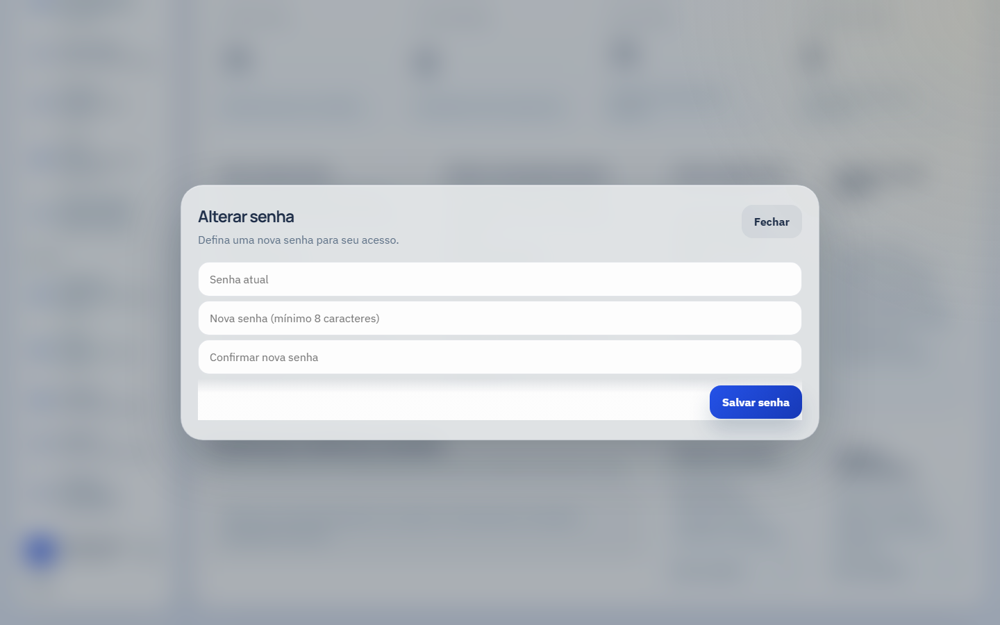

## 4. Navegação geral

Após o login, o sistema exibe um menu lateral com os módulos disponíveis. A barra superior mostra a tela atual, busca global, central de notificações administrativas quando aplicável e alternância entre modo claro e escuro.

A busca global permite localizar rapidamente veículos, posses, condutores e registros operacionais sem navegar manualmente por cada tela.

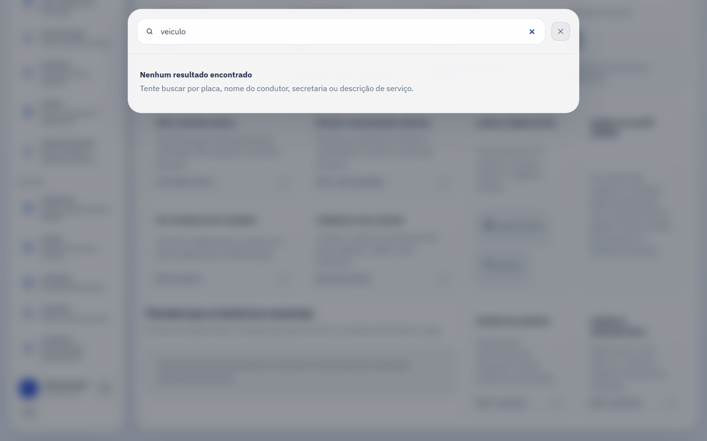

## 5. Início e painel operacional

A tela Início apresenta uma visão rápida da frota: veículos ativos, veículos em manutenção, veículos sem condutor e pendências abertas. Também há atalhos para consultar veículos ativos, revisar manutenções, ver posses sem condutor e cadastrar novo veículo.

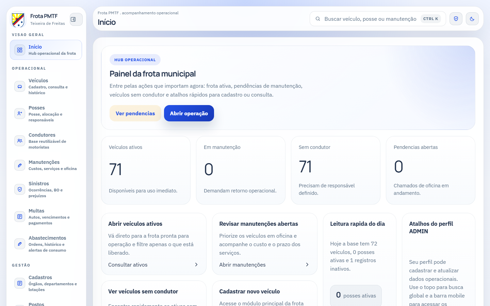

Use esta tela como ponto de partida diário para identificar pendências e acessar os módulos mais importantes.

## 6. Veículos

O módulo Veículos concentra cadastro, consulta, edição e histórico dos veículos. A lista permite filtrar por status, propriedade, lotação e tipo de veículo.

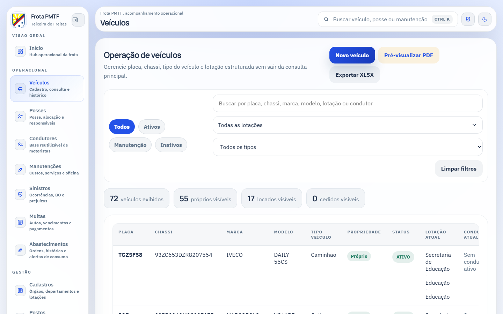

Ao cadastrar ou editar um veículo, informe placa, chassi, marca, modelo, tipo, propriedade, status e lotação. Em edições, o sistema exige justificativa para registrar o motivo da alteração no histórico.

Principais ações:

1. **Novo veículo:** abre o formulário de cadastro.
2. **Histórico:** mostra edições e movimentações de lotação.
3. **Editar:** atualiza os dados cadastrais com justificativa.
4. **Excluir:** disponível apenas para perfis autorizados.
5. **Pré-visualizar PDF e Exportar XLSX:** gera relatórios conforme os filtros aplicados.

## 7. Posses de veículos

O módulo Posses registra quem está responsável por cada veículo, data de início, odômetro inicial, evidências, localização, termo de empréstimo e termo de devolução.

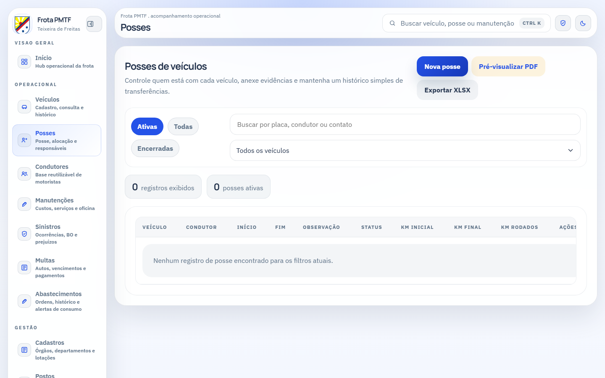

Ao criar uma posse, qualquer posse ativa anterior do mesmo veículo é encerrada automaticamente. O sistema gera o termo de empréstimo em PDF com QR Code e código público de validação, mantendo o anexo assinado como arquivo opcional. Ao encerrar, o sistema também gera o termo de devolução autenticável, e o termo assinado pode ser anexado junto com odômetro final e observações.

Principais rotinas:

1. Criar posse com veículo, condutor, datas, odômetro e observações.
2. Gerar termo de empréstimo, imprimir para assinatura e copiar o link público de validação quando necessário.
3. Anexar termo de empréstimo assinado.
4. Registrar fotos e localização quando necessário.
5. Encerrar posse com dados finais, gerar termo de devolução e anexar o termo assinado.
6. Consultar documentos, fotos, histórico, validações públicas e relatórios.

## 8. Condutores

O módulo Condutores mantém a base reutilizável de motoristas. O cadastro inclui identificação, contato, documento, categoria de CNH, vencimento e status.

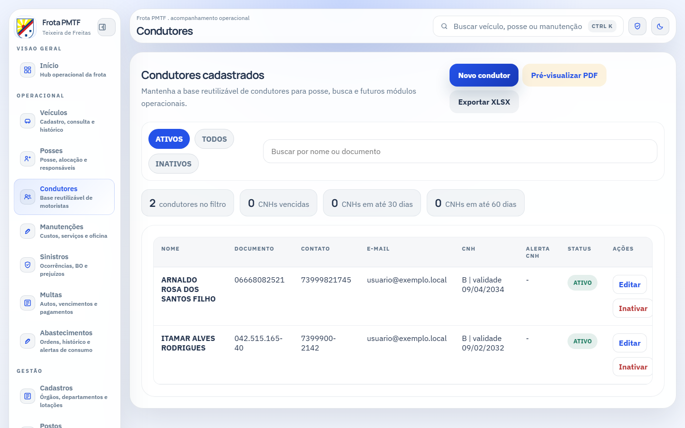

Use este cadastro antes de registrar posses, abastecimentos ou ocorrências associadas a um motorista. Manter dados atualizados reduz retrabalho e melhora a rastreabilidade.

## 9. Manutenções

O módulo Manutenções registra serviços, oficina, peças, custos, datas de início e conclusão, além do status operacional.

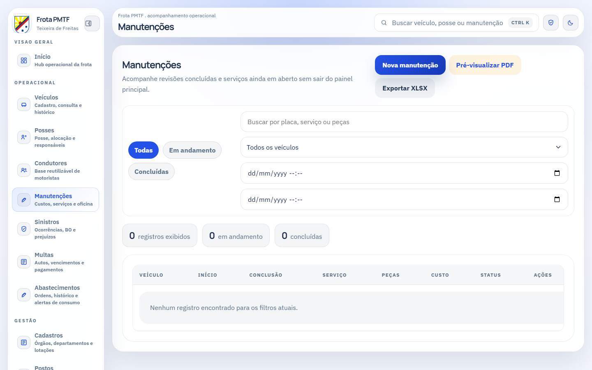

Fluxo recomendado:

1. Abrir nova manutenção para o veículo.
2. Descrever o serviço e peças substituídas.
3. Informar custo total quando disponível.
4. Atualizar status durante o andamento.
5. Encerrar com data final e observações.

## 10. Sinistros

O módulo Sinistros registra ocorrências como avarias, acidentes e prejuízos. O registro pode vincular veículo, condutor, data, local, descrição, boletim de ocorrência, valor estimado e status.

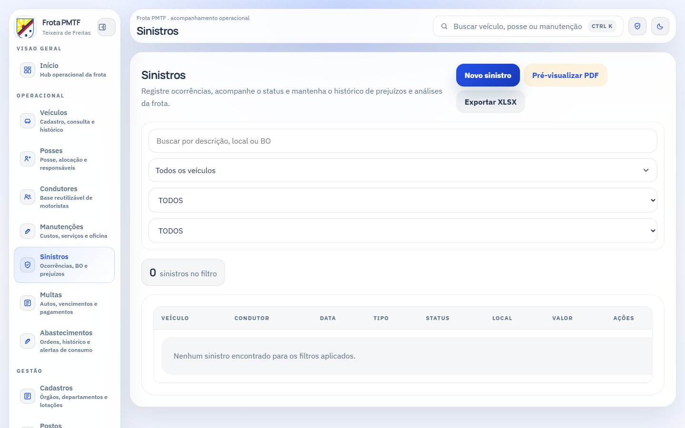

Use o campo de justificativa ou observações para registrar informações complementares. Registros encerrados permanecem disponíveis para consulta e relatórios.

## 11. Multas

O módulo Multas registra autos, vencimentos, valores, status de pagamento ou recurso, veículo e condutor relacionado.

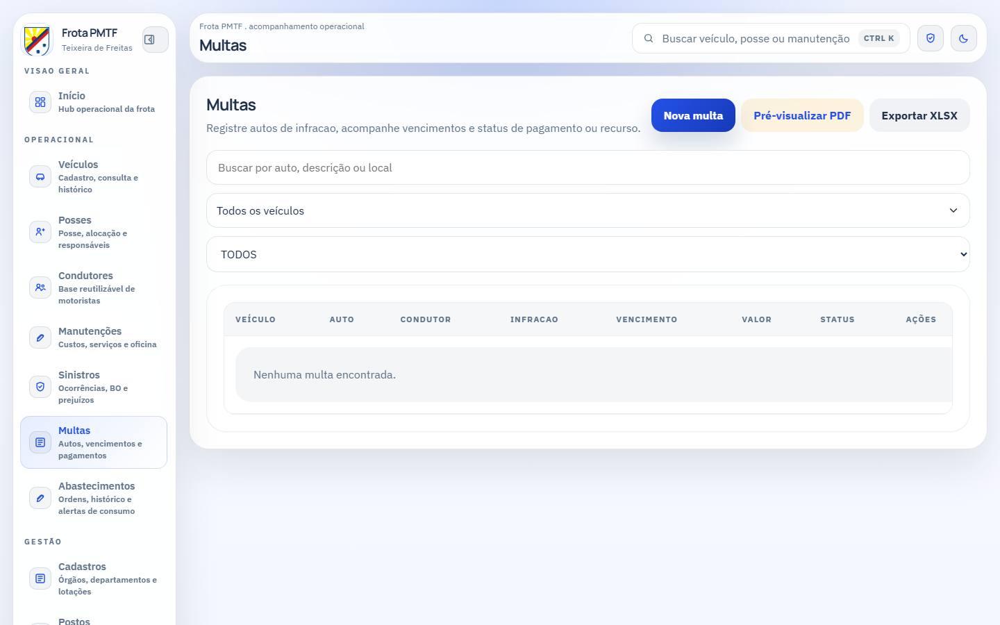

Acompanhe os vencimentos e filtre por status para evitar perda de prazos. As exportações ajudam na prestação de contas e acompanhamento administrativo.

## 12. Abastecimentos e ordens

O módulo Abastecimentos permite emitir ordens para postos credenciados, gerar comprovante institucional com QR Code, validar a ordem publicamente, cancelar ordens abertas e consultar o histórico de abastecimentos confirmados.

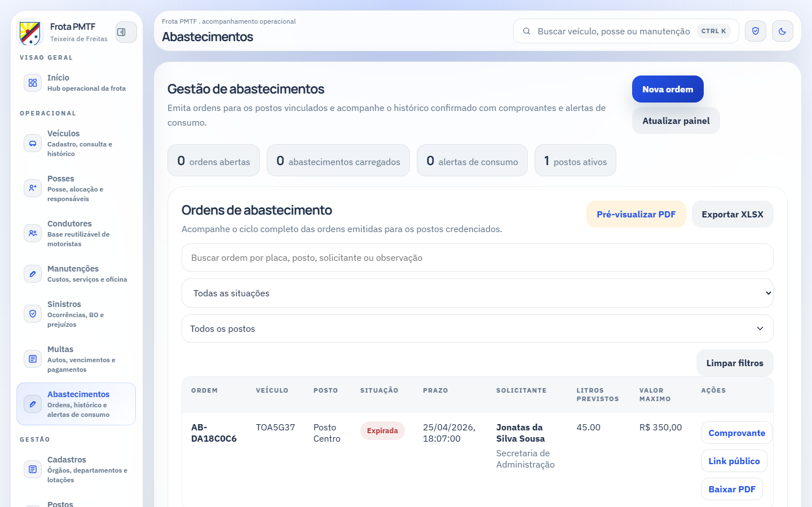

Fluxo administrativo:

1. Abrir Abastecimentos.
2. Clicar em Nova ordem.
3. Selecionar veículo e posto.
4. Informar órgão solicitante, prazo, litros previstos e observações.
5. Gerar comprovante institucional.
6. Acompanhar confirmação ou cancelar ordem aberta quando necessário.

O comprovante da ordem informa os dados institucionais da autorização, o posto credenciado e o link de localização do posto quando houver latitude e longitude cadastradas.

O operador de posto acessa apenas as ordens abertas vinculadas ao seu posto e confirma o abastecimento com dados reais, odômetro, litros, valor total, tipo de combustível, eventuais aditivos, data/hora e comprovante.

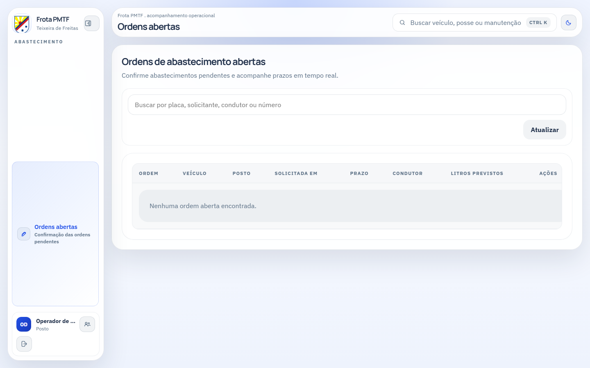

A validação pública do comprovante pode ser acessada por QR Code ou link público, sem login.

## 13. Postos de combustível

Administradores gerenciam postos credenciados, dados cadastrais, telefone, geolocalização selecionada no mapa, status ativo/inativo e vínculos de usuários do perfil POSTO.

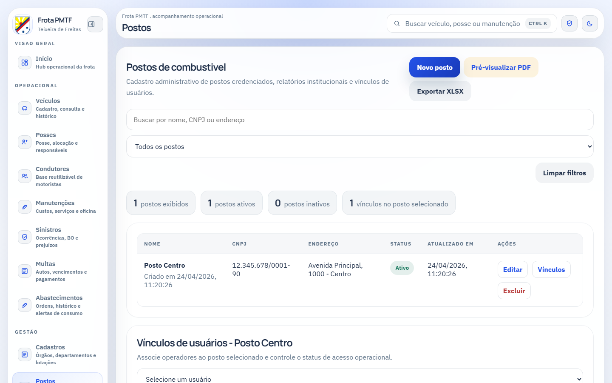

Para que o operador visualize ordens, ele precisa estar vinculado ao posto correto e o vínculo deve estar ativo.

Quando latitude e longitude forem informadas no cadastro, o sistema mostra um link de mapa nas telas e nas validações públicas das ordens de abastecimento.

## 14. Cadastros de lotação

O módulo Cadastros organiza a estrutura institucional usada na lotação dos veículos: órgãos, departamentos e lotações.

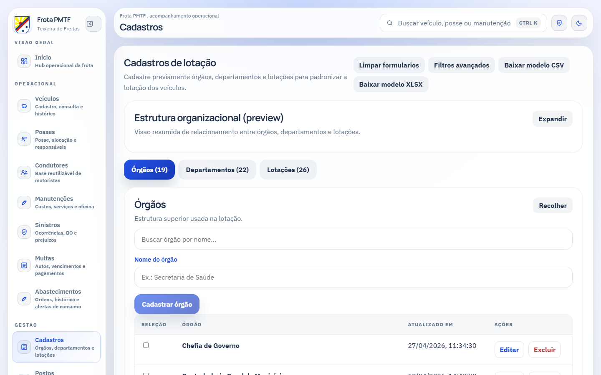

Esta estrutura aparece nos formulários de veículos, ordens de abastecimento e relatórios. Evite duplicar nomes e revise vínculos antes de excluir itens.

## 15. Usuários e permissões

Administradores podem criar, editar e remover usuários, definir perfil e redefinir senha provisória.

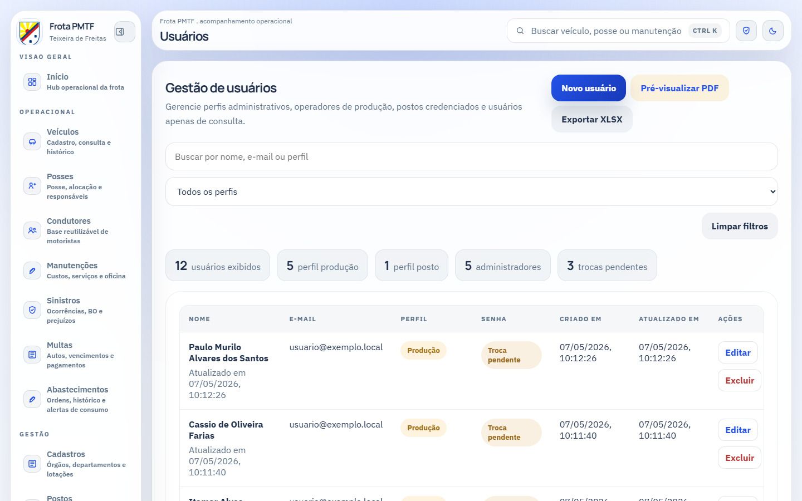

Boas práticas:

1. Escolha o menor perfil necessário para a função.
2. Use senha provisória apenas para criação ou redefinição.
3. Oriente o usuário a trocar a senha no primeiro acesso.
4. Remova ou ajuste perfis quando houver mudança de função.

## 16. Analytics administrativo

O módulo Analytics consolida indicadores operacionais, custos, consumo, risco de condutores, eficiência por tipo de veículo e insights.

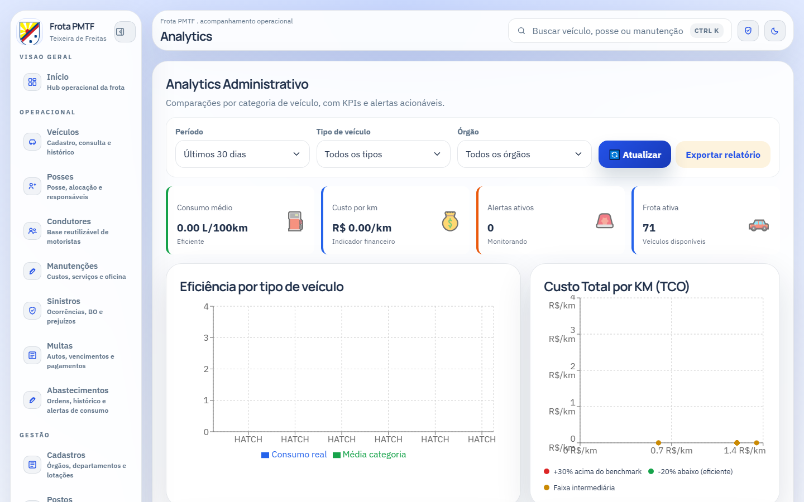

Use os filtros e relatórios para apoiar decisões de gestão, identificar custos fora do padrão e acompanhar evolução mensal.

## 17. Auditoria administrativa

A Auditoria registra criações, edições, exclusões e alterações sensíveis. É possível filtrar por ação, entidade, ator e detalhes.

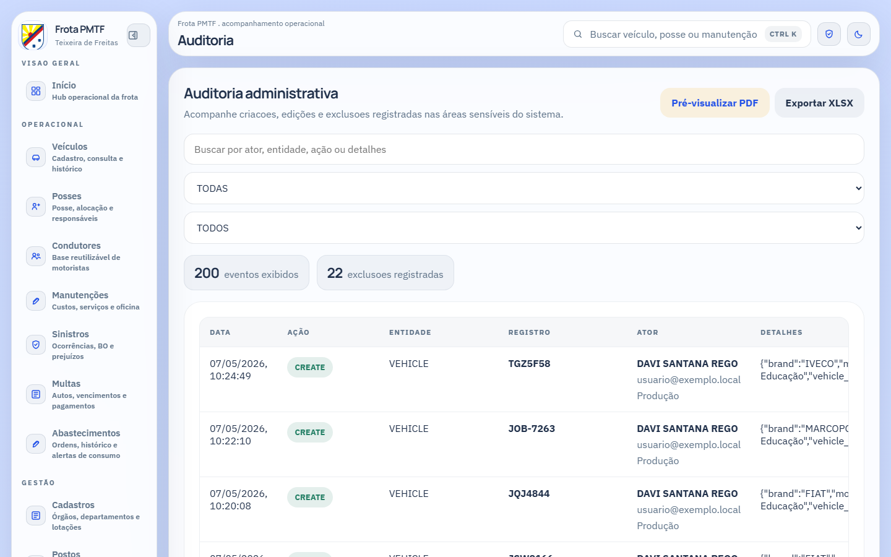

Use a auditoria para conferir quem realizou alterações, quando ocorreram e quais dados foram modificados.

## 18. Relatórios e exportações

Os principais módulos oferecem:

1. **Pré-visualizar PDF:** abre relatório institucional em nova guia.
2. **Exportar XLSX:** gera planilha com os registros filtrados.
3. **Filtros:** restringem o conteúdo antes da exportação.
4. **Histórico:** mantém rastreabilidade para auditoria.

Antes de gerar relatórios, revise filtros de busca, status, datas e lotação para garantir que o documento reflita o recorte correto.

## 19. Rotinas técnicas úteis

Para operação local do projeto, use a Central Operacional:

```powershell
.\FROTA_Iniciar.bat
```

Rotinas comuns:

| Rotina | Uso |
|---|---|
| Iniciar stack dev | Sobe backend e frontend |
| Preparar PostgreSQL local | Banco, migrations e seed |
| Status | Verifica portas, processos e logs |
| Backup manual | Gera backup local e cópia espelhada |
| Configurar backup automático | Agenda backups diários |
| Diagnóstico | Coleta informações para suporte |

Consulte também `README.md`, `QUICK_START.md`, `TROUBLESHOOTING.md` e `SCRIPTS_MANIFEST.md`.

## 20. Checklist rápido de uso diário

1. Entrar no sistema e conferir pendências no Início.
2. Verificar veículos sem condutor ou em manutenção.
3. Registrar novas posses e anexar termos quando aplicável.
4. Atualizar manutenções, sinistros e multas.
5. Emitir e acompanhar ordens de abastecimento.
6. Exportar relatórios necessários.
7. Conferir auditoria em alterações sensíveis.
8. Manter usuários, postos e lotações atualizados.
