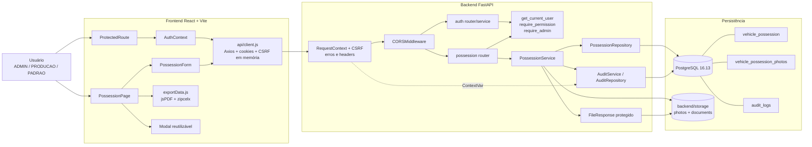
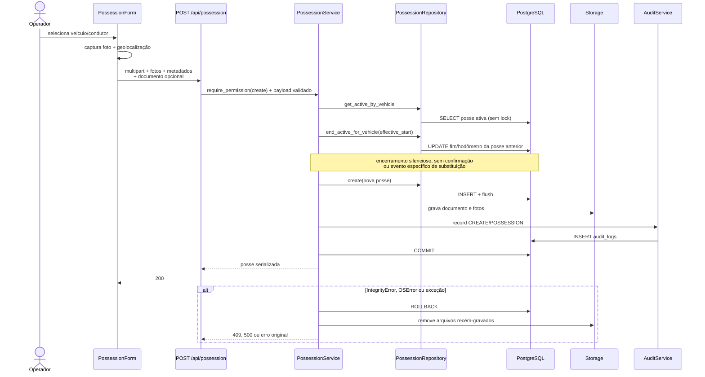

# Diagrama de componentes — baseline e Fase 1

O domínio funcional foi inventariado na Fase 0. A camada transversal de segurança representa a implementação da Fase 1 no commit `61d3433`.

## Sequência atual de criação/substituição

## Fronteiras após a Fase 1 e ausências relevantes

```mermaid
flowchart TB
    CURRENT[Estado após Fase 1]
    CURRENT --> COOKIE[Cookie HttpOnly + SameSite=Lax]
    CURRENT --> RBAC[RBAC granular + teto por perfil]
    CURRENT --> UNIQUE[Índice parcial: uma posse ativa]
    CURRENT --> NOSTORE[no-store em toda API]
    CURRENT --> CSRF[Double-submit CSRF + Origin/Referer]
    CURRENT --> RID[Request ID em resposta, erro e auditoria]
    CURRENT --> CONTEXT[IP/UA/método/path/UTC normalizados]
    CURRENT --> HEADERS[nosniff + referrer + anti-frame + CSP mínima]
    CURRENT --> MASK[Novos detalhes de auditoria sanitizados]

    CURRENT -. ausente .-> TRIP[Rota e destino]
    CURRENT -. ausente .-> RETURN[Confirmação versionada]
    CURRENT -. ausente .-> SERVERREPORT[Registry/relatório de posse no backend]
    CURRENT -. pendente .-> LEGACYAUDIT[Tratamento LGPD das auditorias legadas]
    CURRENT -. pendente .-> PROXY[CIDRs reais do proxy institucional]
```

## Alembic reconciliado

O código e o banco retornam um único head/current `0038_require_user_cpf`. A Fase 1 não alterou migration ou schema. A incompatibilidade registrada no baseline inicial foi resolvida antes da implementação de segurança.
