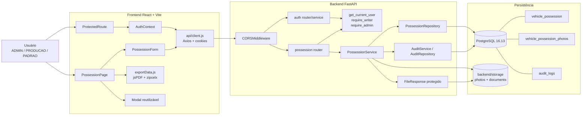
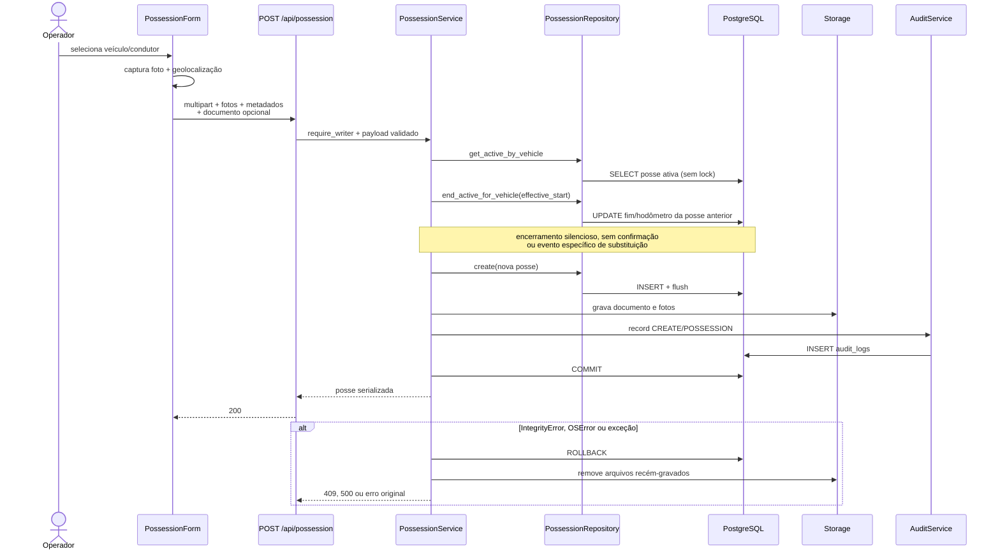
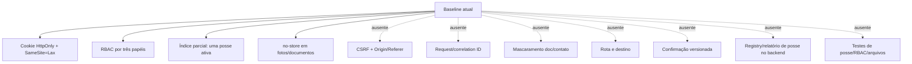

# Diagrama de componentes — baseline da Fase 0

O diagrama representa a branch `feat/posse-rotas-relatorios-devolucao` no SHA `3f956950959f1e38e544ebff09071043db57359f`.

## Sequência atual de criação/substituição

## Fronteiras e ausências relevantes

## Incompatibilidade observada

O banco está marcado em `0038_require_user_cpf`, enquanto o grafo Alembic desta branch termina em dois heads antigos (`0014_fleet_analytics` e `10d2f34e089d`). Portanto, o diagrama da aplicação não cobre todas as tabelas e colunas existentes no banco local. Essa incompatibilidade é bloqueadora para a Fase 1.
