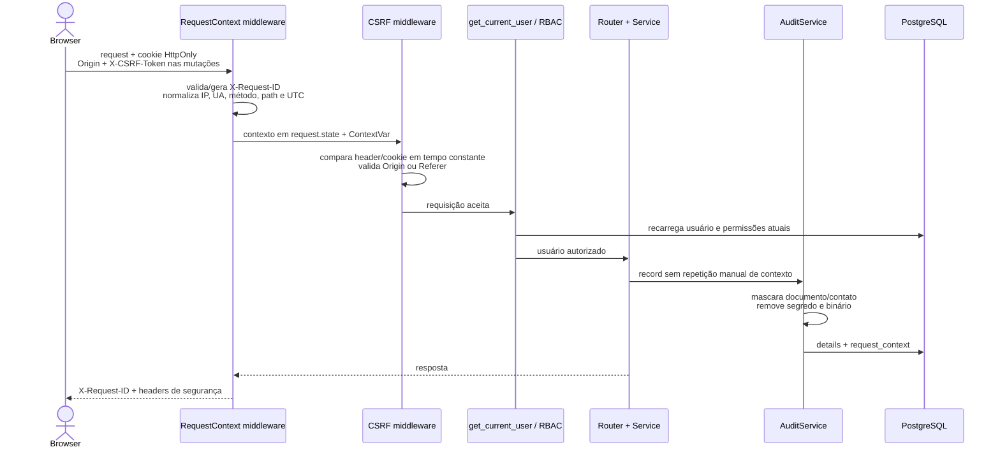

# Relatório da Fase 1 — segurança, auditoria e contexto

Data: **2026-07-11**. Branch: `feat/posse-rotas-relatorios-devolucao`.

## Resultado

A Fase 1 foi implantada no commit funcional `61d3433`. Não foram criados modelos de rota, endpoints de rota, migrations ou alterações de schema. O JWT continua exclusivamente no cookie de autenticação `HttpOnly`; nenhum token foi movido para `localStorage`.

O backend agora associa cada requisição a um `RequestAuditContext` tipado, aplica double-submit CSRF com validação de `Origin`/`Referer`, devolve o request ID em respostas e erros, inclui contexto técnico nas novas auditorias e aplica headers mínimos compatíveis. A autorização continua baseada no usuário recarregado do banco e nas dependências de permissão do backend.

## Fluxo implementado

## Request ID e contexto de auditoria

- Header: `X-Request-ID`.
- Um ID externo só é preservado quando possui de 8 a 64 caracteres, começa por alfanumérico e contém apenas alfanuméricos, `.`, `_` ou `-`.
- Valor ausente ou inválido é substituído por UUID v4.
- `RequestAuditContext` contém request ID, IP normalizado, User-Agent limitado, método, path sem query string e timestamp UTC.
- O contexto fica em `request.state` e em `ContextVar`, com reset ao fim do request; `AuditService.record` permanece compatível e aceita também override tipado opcional.
- Novos detalhes de auditoria limitam profundidade, quantidade e tamanho; tokens, cookies e segredos são removidos; documento/CPF/contato são mascarados; binários são omitidos.
- Registros históricos não foram reescritos. Dados pessoais integrais já gravados em auditorias anteriores continuam como risco residual e devem seguir a política de legado/LGPD.

## Regra de confiança de proxy

`TRUSTED_PROXY_NETWORKS` tem default vazio. Nesse estado, o IP auditado é sempre o peer ASGI e todo `X-Forwarded-For` é ignorado.

Quando redes CIDR forem explicitamente configuradas, o header só é considerado se o peer imediato pertencer a uma dessas redes. A cadeia é limitada a 20 hops e percorrida da direita para a esquerda, descartando apenas proxies confiáveis; o primeiro hop não confiável é considerado cliente. Entradas inválidas não recebem confiança. A lista deve permanecer vazia até a infraestrutura confirmar os CIDRs reais do proxy.

O login passou a usar esse mesmo IP normalizado no rate limit existente. O rate limit continua em memória e não foi redesenhado nesta fase.

## Proteção CSRF

- `GET /api/auth/csrf`, autenticado, emite token aleatório e cookie CSRF separado; o mesmo token é devolvido ao cliente para uso no header.
- O cookie JWT continua `HttpOnly`, `SameSite=Lax`, com `Secure` controlado por ambiente.
- Em `POST`, `PUT`, `PATCH` e `DELETE` autenticados, o backend exige igualdade em tempo constante entre cookie e `X-CSRF-Token`, com limite de 128 caracteres.
- Após o token, exige `Origin` exata em `CSRF_TRUSTED_ORIGINS`; se ausente, aceita `Referer` somente quando sua origem normalizada está autorizada. A lista cai para `CORS_ORIGINS` apenas quando a configuração CSRF específica está vazia.
- Somente o login permanece explicitamente isento. Logout continua protegido.
- CORS mantém origens explícitas e credenciais; métodos e headers são enumerados e `X-Request-ID` é exposto ao navegador.
- O frontend conserva o token CSRF apenas em memória, renova-o pelo endpoint autenticado e inclui uma referência do request ID nas mensagens de erro.

## Erros, logs e headers

- Erros HTTP e de validação incluem `request_id`; valores de entrada são removidos do envelope de validação.
- Erro 500 devolve apenas mensagem genérica. O log interno registra request ID, método, path, tipo da exceção e frames, sem serializar corpo, headers, cookies, valor ou mensagem da exceção.
- Headers aplicados centralmente: `X-Content-Type-Options: nosniff`, `Referrer-Policy: same-origin`, `X-Frame-Options: DENY`, CSP compatível com `frame-ancestors 'none'`, `base-uri 'self'` e `object-src 'none'`, além de `Permissions-Policy` restritiva.
- Respostas sob `/api/` recebem `Cache-Control: no-store`. O hardening integral da CSP permanece para a Fase 7.

## Autorização confirmada

- `get_current_user` decodifica o identificador e recarrega o usuário do banco em toda requisição; o papel do JWT não substitui o papel atual persistido.
- Usuário removido deixa de autenticar. O modelo ainda não possui flag institucional de ativo/bloqueado, portanto nenhuma regra de negócio não aprovada foi inventada.
- `PADRAO` não ultrapassa o teto de leitura do módulo de posses, mesmo com override.
- `PRODUCAO` não passa por `require_admin` e não acessa auditoria administrativa.
- Respostas 401 e 403 permanecem distintas e agora carregam request ID.

## Arquivos funcionais criados/alterados

- Criados: `backend/app/core/request_context.py` e `backend/tests/test_request_context_security.py`.
- Alterados: `backend/app/main.py`, `backend/app/core/config.py`, `backend/app/api/routes/auth.py`, `backend/app/services/audit_service.py`.
- Alterados no frontend/ambiente: `frontend/src/utils/apiError.js`, `backend/.env.example`, `backend/.env.production.example`.
- Testes ampliados: `test_audit_service.py`, `test_csrf_middleware.py` e `test_user_permissions.py`.
- Nenhum arquivo em `backend/alembic` foi alterado.

## Validações e resultados reais

| Comando | Resultado |
|---|---|
| `python -m pytest tests/test_csrf_middleware.py tests/test_audit_service.py -q` | Execução intermediária: 2 passaram e 1 falhou porque o teste legado válido ainda não enviava `Origin`; teste ajustado ao novo contrato |
| `python -m pytest tests/test_csrf_middleware.py tests/test_request_context_security.py tests/test_audit_service.py tests/test_user_permissions.py -q` | Execução intermediária: 28 passaram e 1 falhou; detectou que bytes eram codificados antes da sanitização; ordem corrigida |
| `python -m pytest tests -q` | **Passou: 95 testes**; permanece warning conhecido do `pytest-asyncio` sobre `asyncio_default_fixture_loop_scope` |
| `npm run build` | **Passou:** Vite 6.4.2, 1.071 módulos, 1 min 23 s; warning não bloqueante de chunk principal com 659,02 kB |
| `python -m alembic heads` | **Passou:** único head `0038_require_user_cpf` |
| `python -m alembic current` | **Passou:** banco em `0038_require_user_cpf (head)` |
| `python -m alembic history --verbose` | **Passou:** grafo completo percorrido |
| `git diff --check` | **Passou:** sem whitespace error; apenas avisos de conversão LF/CRLF do Git no Windows |

O teste final passou após a inclusão explícita do caso 401. O valor de 95 deve ser usado como baseline pós-Fase 1.

Versões observadas: Python 3.12.10, Node.js v24.14.0, npm 11.12.1 e Vite 6.4.2. O executável `psql` não está no `PATH`; a versão PostgreSQL 16.13 permanece a evidência do baseline, enquanto a conexão Alembic confirmou o banco e sua revisão atual.

## Impacto de deploy

Não há migration nem transformação de dados. O deploy exige restart da API e rebuild/publicação do frontend. Antes de produção:

1. definir `CSRF_TRUSTED_ORIGINS` apenas com origens HTTPS institucionais;
2. manter `COOKIE_SECURE=true` sob TLS;
3. definir `TRUSTED_PROXY_NETWORKS` somente após confirmar os CIDRs do proxy e alinhar a confiança do servidor ASGI;
4. validar que o proxy não remove `Origin`, `Referer`, `X-CSRF-Token` ou `X-Request-ID`;
5. observar respostas 403 `CSRF_TOKEN_INVALID` e `CSRF_ORIGIN_INVALID` durante o rollout.

Clientes não-browser autenticados por cookie também precisam enviar token CSRF e uma origem autorizada. O contrato de login não mudou.

## Riscos residuais e bloqueios para a Fase 2

- Confirmar no ambiente de publicação os CIDRs do proxy; até lá, `TRUSTED_PROXY_NETWORKS=[]` é a configuração segura e o IP registrado será o peer.
- Confirmar TLS e `COOKIE_SECURE=true` no arquivo de ambiente real; este arquivo não foi alterado nem exposto.
- Decidir futuramente se o modelo de usuário receberá estado ativo/bloqueado. Usuários removidos já são rejeitados, mas não existe flag de bloqueio.
- Auditorias legadas podem conter documento/contato integral; a sanitização vale para novos registros e não houve migration corretiva.
- Rate limit de login permanece local ao processo.
- CSP é deliberadamente compatível e mínima; revisão integral, uploads, path containment e dependências permanecem na Fase 7.
- Não existem scripts de teste frontend, lint ou typecheck; somente o build pôde ser executado.

Esses itens não indicam divergência de schema. A Fase 2 pode ser planejada somente após a validação operacional das origens HTTPS e da topologia de proxy no ambiente de destino.

## Rollback

Reverter o commit funcional `61d3433` e o commit documental/testes subsequente, reconstruir o frontend e reiniciar a API. Não há rollback de banco. Novas linhas de auditoria com a chave JSON `request_context` continuam legíveis pelo código anterior, embora o contexto deixe de ser acrescentado. O rollback restaura o risco de CSRF e deve ser usado apenas em contingência, com bloqueio das mutações no proxy até nova publicação.
