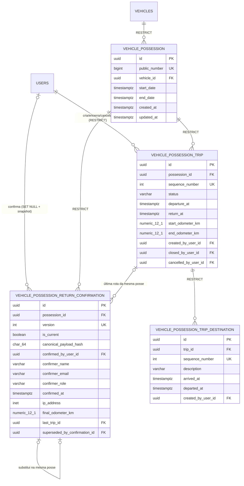

# Relatório da Fase 2 — modelo de dados, integridade e migrations

Data: **2026-07-11**. Branch: `feat/posse-rotas-relatorios-devolucao`. Commit funcional: `185066c`.

## Resultado

A Fase 2 criou o número público estável da posse, rotas, destinos e confirmações versionadas de devolução, além dos repositories mínimos da próxima fase. Nenhum endpoint ou componente de interface foi criado. O banco fonte `frota_db` não foi migrado e permanece em `0038_require_user_cpf`; os upgrades foram executados somente nos bancos isolados descritos neste relatório.

Migration: `0039_possession_trips`. `down_revision`: `0038_require_user_cpf`, confirmado por `heads/current/history` antes da criação. Nenhuma migration aplicada anteriormente foi editada e nenhum `stamp` foi usado.

## Novo schema



## Número público e preservação do legado

Foi criada a sequence PostgreSQL `vehicle_possession_public_number_seq AS BIGINT ... NO CYCLE`, pertencente à coluna `vehicle_possession.public_number`.

O backfill não depende da ordem física da tabela:

```sql
ROW_NUMBER() OVER (
  ORDER BY COALESCE(created_at, start_date), start_date, id
)::BIGINT
```

Primeiro a coluna é nullable e sem default; depois do preenchimento determinístico, a sequence é posicionada no maior número e somente então são aplicados default `nextval`, `NOT NULL`, check positivo e `UNIQUE`. UUIDs e demais campos legados não são alterados.

Na cópia controlada, as 350 posses receberam exatamente os números 1–350, sem nulos ou duplicatas. A sequence terminou em `last_value=350, is_called=true`, portanto o próximo insert receberá número superior e não reutilizará os anteriores. DELETE de posse também é bloqueado por trigger.

## Constraints e SQL relevantes

- `UNIQUE (possession_id, sequence_number)` em rotas.
- Índice parcial único `uq_possession_trip_open ... WHERE status = 'EM_ANDAMENTO'`.
- Checks de sequência positiva, status textual, coerência de fechamento/cancelamento, retorno não anterior à saída e hodômetro final não inferior ao inicial.
- `UNIQUE (trip_id, sequence_number)` e checks de ordem temporal nos destinos.
- `UNIQUE (possession_id, version)` nas confirmações.
- Índice parcial único `uq_possession_return_confirmation_current ... WHERE is_current`.
- Hash canônico restrito a 64 caracteres hexadecimais minúsculos; request ID segue o formato da Fase 1; IP usa `INET`.
- FKs compostas garantem que `last_trip_id` e `superseded_by_confirmation_id` pertençam à mesma posse.
- FK de substituição é `DEFERRABLE INITIALLY DEFERRED`, permitindo marcar a versão anterior e inserir a substituta atomicamente.
- Checks exigem motivo administrativo a partir da versão 2 e encadeamento completo para versão não atual.
- `prevent_possession_domain_delete()` bloqueia DELETE de posse, rota, destino e confirmação.
- `enforce_return_confirmation_append_only()` permite na versão anterior somente a transição controlada de atual para substituída; qualquer outra alteração é recusada.
- A FK histórica `vehicle_possession.vehicle_id` mudou de `ON DELETE CASCADE` para `ON DELETE RESTRICT`.
- Todos os novos tempos são `timestamp with time zone`; hodômetros novos são `numeric(12,1)`.

Foram observados 42 constraints e 19 índices nas três tabelas novas, incluindo os dois índices parciais. O domínio possui oito triggers: atualização de timestamps, bloqueio de deletes e proteção append-only.

## Models e repositories

Models criados:

- `VehiclePossessionTrip`;
- `VehiclePossessionTripDestination`;
- `VehiclePossessionReturnConfirmation`;
- `VehiclePossessionTripStatus`, persistido como texto com check, não enum nativo.

Repositories mínimos:

- busca de rota por ID + posse;
- busca da rota em andamento com lock opcional;
- listagem por posse com `selectinload` de destinos;
- criação de rota/destino sem métodos de delete;
- sequência de rota e destino serializada por lock no registro pai;
- busca da confirmação atual com lock opcional;
- próxima versão serializada por lock na posse;
- criação append-only da confirmação, sem delete.

O teste de carga eager confirmou duas consultas para rota + destinos, independentemente da quantidade de destinos observada, evitando N+1 no caminho preparado para a Fase 3.

## Ensaio em banco limpo

Banco isolado: `frota_phase2_clean_20260711_01`.

O primeiro comando direto `python -m alembic upgrade head` falhou antes da nova migration, na revisão 0034, com `UnsafeNewEnumValueUsage`: o grafo antigo adiciona `PRODUCAO` na 0003 e tenta usá-lo na mesma transação longa. Essa falha pré-existente não foi ocultada nem atribuída à 0039.

Sem editar migration ou usar `stamp`, o mesmo banco vazio foi migrado com uma fronteira real de commit:

```text
python -m alembic upgrade 0003_role_audit
python -m alembic upgrade head
```

Resultado: sucesso até `0039_possession_trips (head)`. Em seguida, `PHASE2_TEST_DATABASE_URL=<banco-limpo> python -m pytest tests/test_phase2_possession_schema.py -q` aprovou **11 testes em 2,60 s**.

Os testes PostgreSQL cobriram números públicos, tabelas/heads, rota aberta única, sequências duplicadas de rota e destino, retorno anterior, hodômetro inferior, ordem temporal de destino, confirmação atual única, append-only, cadeia de correção, bloqueio de DELETE, eager loading e concorrência real entre duas transações.

## Ensaio em cópia controlada

A tentativa inicial de `createdb --template=frota_db` foi recusada porque havia cinco sessões ativas. Nenhuma sessão foi encerrada. A cópia foi criada com `pg_dump --format=custom` consistente e restaurada com `pg_restore --no-owner --no-privileges --exit-on-error` em `frota_phase2_copy_20260711_01`.

### Comparação antes/depois

| Medida | Antes (`0038`) | Depois (`0039`) |
|---|---:|---:|
| Posses | 350 | 350 |
| Fotos da galeria | 2 | 2 |
| Documentos de entrega | 7 | 7 |
| Documentos de devolução | 1 | 1 |
| Códigos de termo de entrega | 350 | 350 |
| Códigos de termo de devolução | 350 | 350 |
| Veículos | 223 | 223 |
| Usuários | 35 | 35 |
| Auditorias | 2.167 | 2.167 |
| Colunas de `vehicle_possession` | 31 | 33 |
| Constraints de `vehicle_possession` | 3 | 5 |
| Índices de `vehicle_possession` | 7 | 8 |
| Rotas novas | inexistente | 0 |
| Destinos novos | inexistente | 0 |
| Confirmações novas | inexistente | 0 |

Checksums antes/depois:

- IDs das posses: `7c807df9324d997cf62572efcbe617e2`;
- referências de arquivos: `45156d8077df4a1a77984dd346d7cb6c`.

Ambos permaneceram idênticos. Das dez referências de arquivo do banco fonte, **10/10** continuam presentes no storage; a migration não acessa nem altera arquivos.

Após `python -m alembic upgrade head`, `alembic current` retornou `0039_possession_trips (head)`. O banco fonte foi novamente consultado e continuou em `0038_require_user_cpf`.

Os bancos de validação foram preservados, sem drop ou recriação, para auditoria das evidências. A cópia contém dados operacionais e deve permanecer com o mesmo controle de acesso do banco fonte até sua remoção operacional autorizada.

## Comandos e resultados

| Comando | Resultado real |
|---|---|
| `python -m alembic heads/current/history --verbose` antes da migration | head/current real `0038_require_user_cpf`; histórico íntegro |
| `python -m alembic upgrade head` no banco vazio | Falha pré-existente na 0034 por enum `PRODUCAO` sem commit intermediário |
| `python -m alembic upgrade 0003_role_audit` + `python -m alembic upgrade head` no banco vazio | Passou; clean DB em `0039_possession_trips` |
| `pg_dump` + `pg_restore` da base existente | Passou; cópia consistente criada sem encerrar sessões |
| `python -m alembic upgrade head` na cópia em 0038 | Passou; somente 0039 aplicada |
| testes PostgreSQL da Fase 2 | **11 passed em 2,60 s** |
| `python -m pytest tests -q` sem banco de integração | **97 passed, 9 skipped em 5,33 s**; skips são os testes PostgreSQL condicionados à variável dedicada |
| `npm run build` | **Passou:** 1.071 módulos em 1 min 26 s; warning conhecido de chunk com 659,02 kB |
| `python -m alembic check` no clean DB | Falhou por diffs preexistentes em JSON/índices/FKs de outros módulos; não apontou divergência nas entidades da Fase 2 |
| `git diff --check` | Passou; somente avisos LF/CRLF do Git no Windows |

## Downgrade e rollback

O downgrade técnico é deliberadamente guardado. Se qualquer rota, destino ou confirmação existir, ele aborta antes de remover estrutura, orientando restauração de backup. Quando as tabelas novas estão vazias, ele consegue remover a estrutura, a sequence e os números públicos e restaurar a FK histórica, mas isso elimina identificadores já potencialmente publicados e reintroduz `CASCADE`.

Portanto, downgrade não é rollback operacional seguro após uso. Em produção, o rollback deve restaurar backup compatível de banco e aplicação em ambiente controlado. A migration não foi rebaixada nos bancos de validação porque isso destruiria a evidência criada e contraria a preservação exigida.

## Riscos e pré-condições para a Fase 3

1. Aplicar a 0039 antes de publicar o código que seleciona `public_number`; o banco fonte ainda está em 0038.
2. Toda alocação de sequência/versão deve permanecer na mesma transação que cria o registro; liberar o lock antes do insert elimina a garantia do repository.
3. A substituição de confirmação deve pré-gerar o UUID, marcar a versão anterior como substituída e inserir a nova versão na mesma transação, respeitando FK deferred e índice parcial.
4. Mapear violações de unique/check/trigger para respostas 409/422 seguras sem expor SQL.
5. Validar no service que a posse está ativa, que a rota cabe no período da posse e que o hodômetro da rota é coerente com posse/rota anterior; são invariantes entre linhas e não foram antecipadas nesta fase.
6. FKs de autoria de rota/destino usam `RESTRICT`; exclusão física de usuário com histórico será bloqueada, conforme preservação. Ainda não existe estado ativo/bloqueado para usuário.
7. Campos legados de hodômetro continuam `Float`; a fronteira com os novos `Decimal` deve ser normalizada explicitamente.
8. Não criar rotas artificiais para as 350 posses legadas sem evidência.
9. O débito antigo do upgrade vazio em uma única transação deve ser considerado no CI de migrations; o caminho de produção 0038→0039 não é afetado.
10. O ruído preexistente de `alembic check` deve ser reconciliado em tarefa própria, sem gerar migration automática misturando outros módulos.

Nenhuma atividade da Fase 3 foi iniciada.
