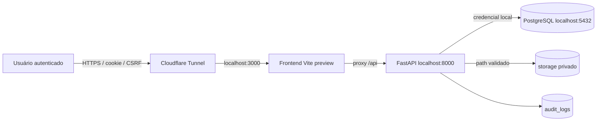

# Threat model — posse, rotas, termo e relatórios

Data da revisão: 2026-07-13. Método: STRIDE adaptado. Escopo: autenticação por cookie, APIs de posse/rota/devolução, arquivos, termo, relatórios e operação local publicada pelo Cloudflare Tunnel.

## Fronteiras de confiança

O TLS termina na borda do tunnel. Frontend, API e PostgreSQL devem aceitar conexões apenas no host local. O backend é a fonte de verdade para autenticação, CSRF, RBAC, escopo organizacional e classificação de colunas.

## Ameaças, controles e risco residual

| ID | Ativo / ameaça e vetor | Impacto | Controles implementados | Evidência de teste | Residual |
|---|---|---|---|---|---|
| T-01 | Sessão / roubo ou falsificação de cookie | Acesso indevido | cookie HttpOnly, Secure em produção, SameSite, segredo aleatório, expiração e logout | suíte de auth/segurança; configuração fail-closed | Baixo; rotação do segredo encerra sessões existentes |
| T-02 | Mutações / CSRF por site externo | Alteração em nome do usuário | double-submit, Origin/Referer e origens HTTPS explícitas | testes CSRF das Fases 1, 3, 5 e 6 | Baixo |
| T-03 | Recursos aninhados / IDOR por UUID de outra posse | Leitura ou mutação cruzada | consultas de rota/destino sempre vinculadas a `possession_id`; escopo organizacional | testes IDOR Fase 3 e suíte completa | Baixo |
| T-04 | RBAC / override individual acima do papel | Escalonamento | teto por perfil no backend; `require_writer`, `require_admin` e permissão granular | testes dos quatro perfis e role tampering | Baixo |
| T-05 | Estado / duas operações concorrentes | Dupla posse, rota ou confirmação | transação, row lock, índices parciais e confirmação append-only | testes de concorrência Fases 2, 3 e 5 | Baixo |
| T-06 | Upload / arquivo excessivo | Exaustão de memória ou disco | limite global de corpo e leitura `limite + 1`; resposta 413 | `test_security_headers_and_request_size_limit` | Médio; streaming antivírus depende da infraestrutura |
| T-07 | Upload / MIME ou extensão forjada | Conteúdo ativo armazenado | allowlist, magic bytes e validação estrutural DOCX | casos PDF/JPEG/PNG/WebP válidos e falsos | Baixo; malware sem spoofing exige scanner institucional |
| T-08 | Storage / path traversal ou nome malicioso | Leitura fora do storage/header injection | `resolve()` com contenção, rejeição de absoluto/`..`, filename de download opaco | teste de contenção e download | Baixo |
| T-09 | Textos / XSS armazenado ou refletido | Execução no navegador | React escapa texto; CSP; nenhuma renderização HTML de origem/finalidade/destino | suíte frontend e revisão de sinks | Baixo |
| T-10 | XLSX / formula injection | Execução de fórmula ao abrir arquivo | prefixo seguro para `=`, `+`, `-`, `@`, inclusive após whitespace | testes da Fase 6 | Baixo |
| T-11 | PDF / exposição de dados | Vazamento documental | geração oficial no backend, registry/RBAC, autenticação, `no-store`, auditoria | testes PDF/RBAC/headers | Baixo |
| T-12 | Logs / documento, contato, segredo ou binário | Ampliação de exposição | auditoria guarda IDs/metadados mínimos, não binários; logs sem payload integral | testes de auditoria e revisão | Baixo |
| T-13 | Cache / termo ou relatório reutilizado | Vazamento entre usuários | `Cache-Control: no-store`, download autenticado e nome opaco | testes de headers; verificação pública pós-deploy | Baixo |
| T-14 | Geolocalização / coleta ou exposição excessiva | Dado pessoal sensível operacional | permissão do navegador, campo restrito, ausente para PADRAO; Permissions-Policy | RBAC de relatório e revisão por perfil | Médio; retenção institucional ainda não definida |
| T-15 | Headers forjados / request ID e IP | Auditoria enganosa | só confia proxy em redes explícitas; request ID inválido é substituído | testes de forwarding/request context | Baixo |
| T-16 | Relatório amplo / DoS | Memória e indisponibilidade | filtros server-side, 1.500 linhas PDF, 5.000 XLSX, sem carregar base no frontend | testes de limite e probe de queries | Médio; exportação ainda é em memória |
| T-17 | Dependências vulneráveis | Comprometimento de runtime | versões fixadas; `npm audit`; `pip-audit`; upgrades testados | Node 0; Python apenas `ecdsa` residual | Baixo: `ecdsa` não é alcançável porque JWT aceita somente HS256 |
| T-18 | Backup/rollback inválido | Perda ou indisponibilidade prolongada | ZIP com SHA-256, restauração em DB descartável, contagens antes/depois e plano de rollback | ensaio 2026-07-13, 65,8 s | Baixo |
| T-19 | Hard delete de posse | Apagamento de histórico | endpoint não mutativo retorna 409 e audita tentativa; sem cascade histórico novo | testes Fases 1–3 | Baixo |
| T-20 | API/docs de produção expostas | Reconhecimento e abuso | docs/OpenAPI desabilitados em produção, hosts explícitos e CSP | configuração fail-closed; smoke pós-deploy | Baixo |

## Decisões residuais

- A política e a ferramenta de varredura antimalware permanecem decisão de infraestrutura. Até lá, arquivos são privados, autenticados, limitados e validados por tipo real.
- Prazos de retenção e descarte de anexos, geolocalização e auditoria dependem de decisão administrativa/jurídica; nenhum prazo foi inventado.
- O pacote transitivo `ecdsa 0.19.2` possui aviso sem versão corrigida. O sistema fixa `ALGORITHM=HS256` e chama `jwt.decode(..., algorithms=[settings.ALGORITHM])`; nenhum algoritmo ECDSA é aceito. O risco passa a ser reavaliado se o algoritmo mudar.
- HSTS deve ser imposto e verificado na borda HTTPS; não é seguro habilitá-lo em respostas HTTP locais utilizadas pelo tunnel.
